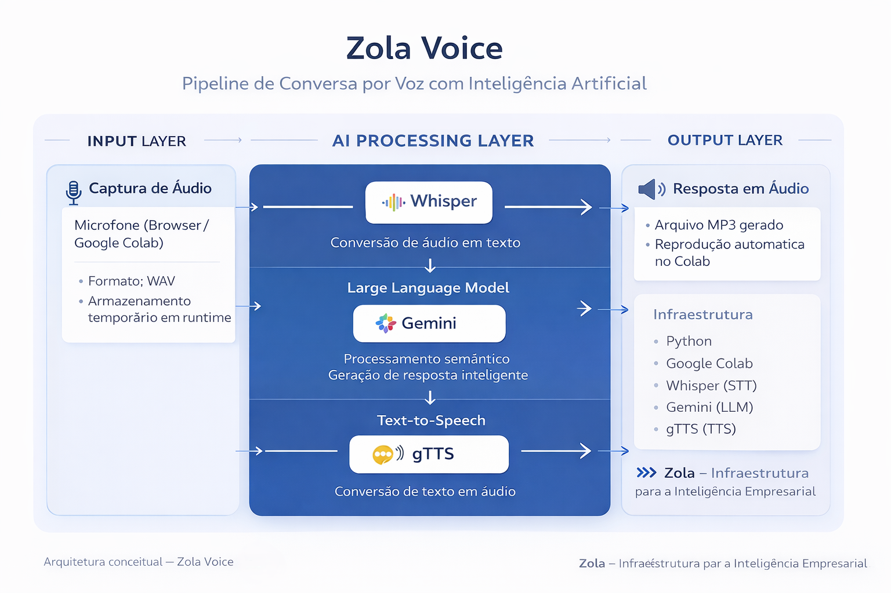
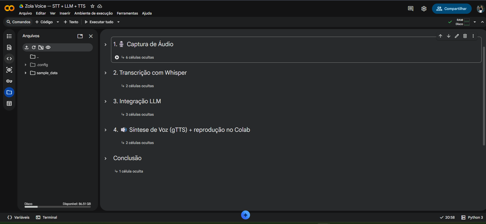

# 🎙 Zola Voice  
Pipeline de Conversa por Voz com Inteligência Artificial  

---

##  Visão Geral

Zola Voice é uma prova de conceito (POC) que implementa um pipeline completo de interação por voz, estruturado em camadas e orientado a arquitetura modular.

A solução integra:

- Speech-to-Text (STT)
- Large Language Model (LLM)
- Text-to-Speech (TTS)

O objetivo é demonstrar como organizar uma infraestrutura de IA conversacional de forma clara, desacoplada e evolutiva.

---

## Arquitetura da Solução

### Camadas da Arquitetura

 ✔️ **Input Layer**  
Captura de áudio via navegador (Google Colab).  
Armazenamento temporário em runtime.

 ✔️ **AI Processing Layer**
- Whisper → Conversão de áudio em texto  
- Gemini → Processamento semântico e geração de resposta  
- gTTS → Conversão de texto em áudio  

 ✔️ **Output Layer**  
Geração de arquivo MP3 e reprodução automática da resposta.

---

##  Evidência Técnica

Implementação modular validada em ambiente controlado (Google Colab):

  

O notebook foi organizado em seções independentes:

1. Setup  
2. Captura de Áudio  
3. Transcrição  
4. Integração com LLM  
5. Síntese de Voz  
6. Conclusão  

Essa organização garante clareza, rastreabilidade e facilidade de evolução da solução.

---

##  Tecnologias Utilizadas

- Python
- Google Colab
- Whisper (STT)
- Gemini (LLM)
- gTTS (TTS)

---

##  Fluxo de Execução

1. Captura do áudio do usuário  
2. Transcrição com Whisper  
3. Processamento semântico com LLM  
4. Síntese da resposta em áudio  
5. Reprodução automática  

---

##  Contexto

Projeto desenvolvido no Bootcamp **GenAI & Dados (DIO + Bradesco)**, estruturado como iniciativa autoral dentro da proposta:

---

##  Próximas Evoluções

- Interface Web dedicada  
- Containerização (Docker)  
- Deploy em ambiente próprio  
- Persistência de histórico  
- Integração com backend estruturado  
- Substituição do gTTS por TTS nativo via API  

---

Zola — Infraestrutura para a Inteligência Empresarial

